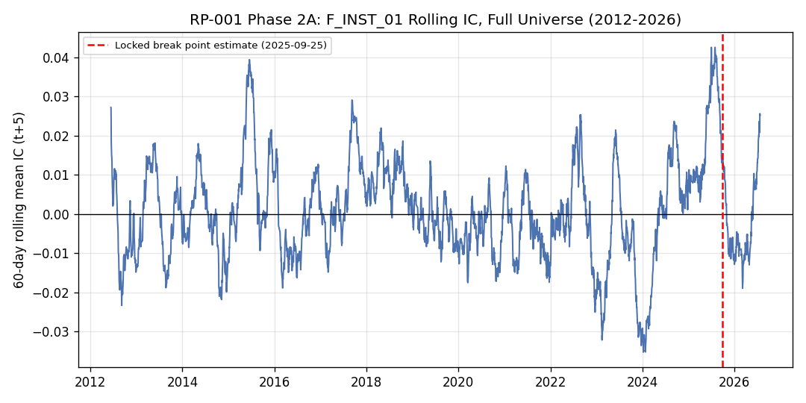

# RP-001:外資買賣超能預測台股報酬嗎?

## 研究問題

外資法人單日買賣超是否能預測台灣股票未來 1-5 天的橫斷面報酬?這是台股最常被討論、卻很少被嚴謹樣本外驗證的訊號之一。

## 為什麼重要

任何在一份資料上「發現」規律、又在同一份資料上「驗證」規律的研究,都無法排除自我循環的可能。這正是計量金融最容易犯的錯誤,也是本研究刻意分成兩階段執行的原因。

## 研究流程

**探索性階段**(50 檔股票,~2 年):自由搜尋因子定義、斷點、條件變數,發現外資買賣超具條件式預測力。

**確認性階段**(全市場,~14 年):在採集資料**之前**先鎖定因子定義、報酬窗口、統計方法與五項假設,再用完全獨立的全市場資料重新檢定,不做任何事後調整。

## 資料規模

2,255 檔股票(TWSE + TPEx,含下市股)、2012-2026 年、6,765 次 API 請求、3,400 萬列原始資料、100% 成功採集。最終確認性檢定樣本:1,462 檔股票、393 萬列面板資料。

## 核心方法

Spearman 橫斷面 Rank IC、Newey-West 修正 t 檢定、橫斷面殘差化(交互作用檢定)、Benjamini-Hochberg 多重檢定校正。

## 主要發現

五項預註冊假設中,**三項未複現**(含最核心的「斷點前預測力」與「波動度條件性」),一項部分複現,一項複現但證據力弱。核心效果的量級在全樣本規模下縮減 40-70 倍,統計上與零無異。

*圖:F_INST_01 於完整 14 年歷史的 60 天滾動 IC——並未呈現「斷點前穩定為正」的形態,這正是 H-C1 未能複現的直接視覺證據。*

## 未複現結果(誠實報告,非失敗)

外資買賣超的核心預測力、其斷點依附性、低波動機制——這三項探索階段最重要的發現,均未能在全市場規模下複現。這是預註冊確認性驗證設計的目的,不是研究失敗。

## 我的貢獻

獨立完成從假設設計、預註冊、全市場資料採集、資料品質工程(發現並修復 2 個真實管線 bug)、統計檢定、到誠實報告負面結果的完整流程。

## 技術能力

Python(pandas/numpy/scipy)、大規模 API 資料採集與速率限制處理、資料管線除錯、統計推論(Newey-West、FDR 校正)、Git 版本控制與可重現性工程。

## 研究能力

假設預先鎖定、Deviation 治理、負面結果的誠實報告、統計顯著性與經濟意義的區分。

## GitHub / Reproducibility

完整原始碼、報告、圖表與 SHA-256 雜湊皆已提交版本控制(最終 commit `40a2be9`)。原始資料本身(3.7GB)未納入版本控制,但每一筆下載皆有雜湊記錄,流程可完整重現。
