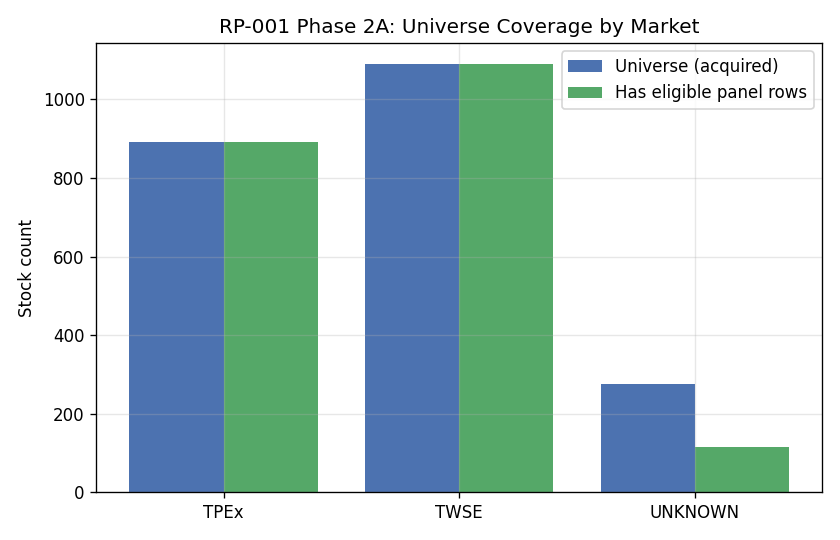
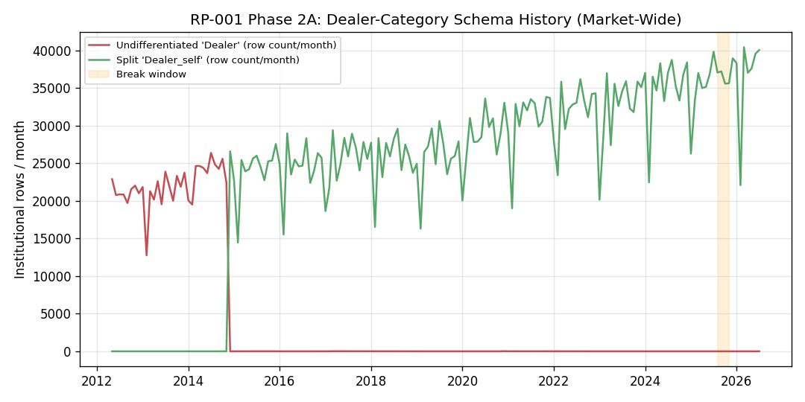
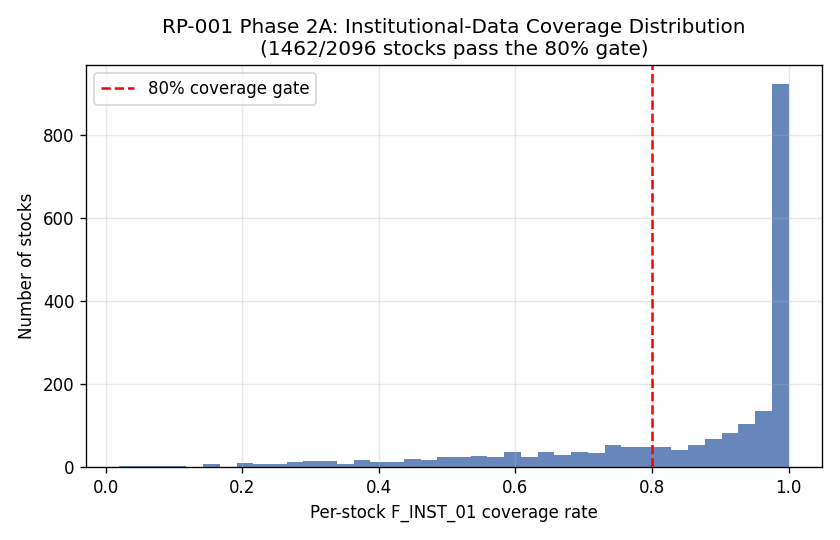
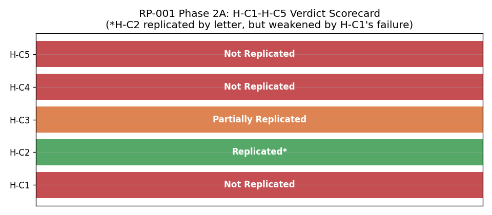
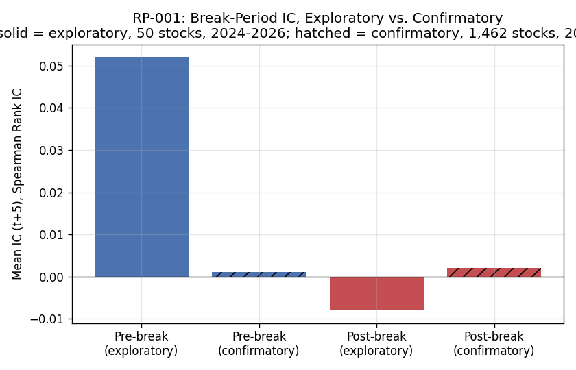
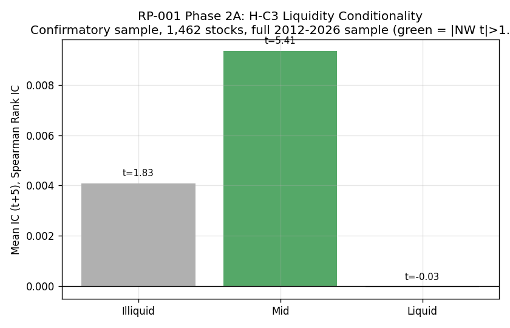
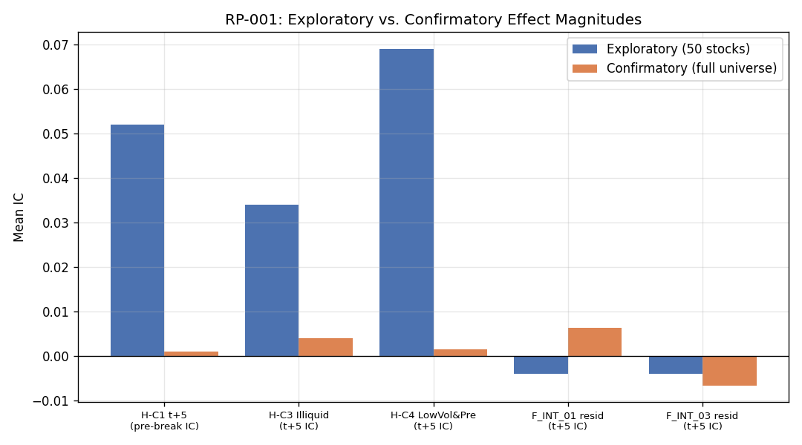

# RP-001 最終成果展示

**台灣法人籌碼因子研究:從探索性發現到全樣本確認性驗證**

日期:2026-08-03 | 狀態:Phase 2A(全樣本確認性驗證)已完成

---

## A. 研究問題

外資法人單日買賣超(淨流量)是否能預測台灣股票的橫斷面短期報酬?若能,這個訊號在什麼條件下成立、什麼條件下消失?

這個問題來自 `taiwan-attention-momentum-signal` 專案的延伸假設,也是法人籌碼因子在學術與業界文獻中最常被討論、卻也最常缺乏嚴謹樣本外驗證的主題之一。

## B. 研究方法

兩階段設計,刻意分開執行,避免「用同一份資料發現規律又用同一份資料驗證規律」的自我循環:

1. **探索性階段**(50 檔大型股,2024-07 至 2026-07,約 2 年):自由搜尋因子定義、結構斷點、流動性與波動度條件——允許資料窺探,但明確標註「探索性」,不宣稱已驗證。
2. **確認性階段(Phase 2A)**:預先鎖定五項假設(H-C1 至 H-C5)、因子定義、報酬窗口、斷點日期、統計方法,**在探索階段完全沒看過的全市場資料**上,只執行這五項測試,不做任何新的資料窺探或事後調整。

統計方法:Spearman 橫斷面 Rank IC、Newey-West 修正 t 檢定(5 期落後)、橫斷面 OLS 殘差化(交互作用檢定)、Benjamini-Hochberg FDR 校正(α=0.10)。全部方法沿用探索階段已驗證的程式碼,確認階段未重新設計任何統計方法。

## C. 資料規模

| | 探索性階段 | 確認性階段(Phase 2A) |
|---|---|---|
| 股票數 | 50 檔(大型股為主) | **2,255 檔**(全部 TWSE 上市 + TPEx 上櫃,含下市股) |
| 期間 | 約 2 年(2024-07 至 2026-07) | **約 14 年**(2012-01 至 2026-08) |
| 交易日 | 491 天 | **3,283 個 pre-break 交易日** |
| 原始資料列數 | — | 34,236,687 列(3.7GB) |
| API 請求數 | — | 6,765 次,100% 成功解析,零筆未解決失敗 |
| 進入確認性樣本的股票 | — | 1,462 檔(通過 80% 資料覆蓋率門檻) |

## D. 資料品質修復

全樣本採集過程中發現並修復兩個真實的採集工具 bug(詳見 `research/RP001_PHASE2A_DEVIATION_LOG.md`):

1. 連線中斷導致批次「看似完成但實際未完成」就被誤判通過完整性檢查——已修正,改為只有真正下載完成才放行。
2. 部分股票代碼(如 TDR 存託憑證)對本益比資料集回傳合法的空值,卻被誤判為需要重試,造成無限重試迴圈(卡住約 5 小時)——已修正,並清理 391 筆因此產生的重複紀錄。

法人分類(Dealer vs. Dealer_self/Dealer_Hedging)歷史語義調查:全市場在 **2014 年 12 月**有一次清楚的制度轉換,但另有 **69 個個別股票案例**在轉換後仍偶爾恢復使用未拆分的 `Dealer` 分類,每一個案例都經過逐一查證——**F_INST_01 唯一依賴的外資買賣超欄位,在全部 69 個案例中零例外地完整存在**,不受影響。

缺值處理:從不將缺值填為 0,顯性零(真實回報「無淨買賣」)予以保留(180,445 筆),其餘缺值以 NaN 處理並在橫斷面計算中排除。個股層級要求至少 80% 資料覆蓋率才進入確認性樣本。

## E. 探索性研究發現(原始結論,未被覆寫)

> 外資買賣超對台灣股票橫斷面報酬展現條件式預測力,集中於已識別的斷點區間之前,且在中低流動性股票中較強。此效果在斷點後消失,且未被證明具因果性。七個交互作用因子在控制其成分因子後,均未提供真正的增量資訊。

(原文保留於 `archive/RP001_RESEARCH_REPORT_v0.1.md`,本次展示不做任何美化或刪改。)

## F. 確認性研究結果

在全樣本、全歷史規模下重新檢定同樣的五項假設:

F_INST_01 的 60 天滾動 IC 在完整 14 年歷史上呈現規律的正負震盪,並沒有「斷點前穩定為正、斷點後歸零」的清楚形態——這與探索性階段在 2 年樣本上觀察到的模式明顯不同。

## G. H-C1～H-C5 判定

| 假設 | 內容 | 判定 |
|---|---|---|
| H-C1 | 斷點前 IC 為正 | **未複現** |
| H-C2 | 斷點後 IC 趨近於零 | **複現**(但證據力弱,見下方說明) |
| H-C3 | 流動性條件性(不流動股效果較強) | **部分複現** |
| H-C4 | 波動度效果依附於斷點,非獨立效果 | **未複現** |
| H-C5 | 七個交互作用因子皆非真實效果 | **未複現**(新的意外發現) |

**H-C2 的重要但書**:由於 H-C1 本身就沒有找到顯著的斷點前效果,「斷點後效果消失」在邏輯上失去了原本的對照意義——這不是「效果存在後又消失」,而是「兩段都測不到效果」,證據力遠不如原始設計預期的強。

## H. 通過／失敗的 Feature

| Feature | 探索階段狀態 | Phase 2A 全樣本結果 |
|---|---|---|
| F_INST_01(外資買賣超) | Frozen-Conditional(唯一達到此等級） | **核心預測力未複現**——三個 horizon 的斷點前 IC 統計上皆與零無異 |
| F_INT_01, 03, 04, 07(4 個交互作用因子) | Confirmed Artifact(視為虛假關聯） | **統計上顯著的殘差訊號存活**,但量級極小(比原始 raw IC 小 75-95%) |
| F_INT_05(外資×波動度交互作用) | Confirmed Artifact | 臨界值邊緣(t=1.99),未通過 FDR 校正 |
| F_INT_02, F_INT_06(規模相關交互作用) | Confirmed Artifact | **無法檢定**——全樣本規模缺乏市值資料(D-08 偏離事項) |

## I. 結構轉折是否複現?

**否。** 探索階段發現的「斷點前 IC=0.052(t=3.99)、斷點後 IC=-0.008」在全樣本上完全沒有重現——斷點前 IC 僅 0.0011(t=0.735),統計上與零無異。斷點前後對照失去意義,因為「前」本身就不顯著。

## J. 流動性條件是否複現?

**部分複現。** 方向正確(不流動、中流動性股票的 IC 皆高於流動股票,流動股票本身不顯著),但強度不對稱——只有「中流動性」組別獨立達到統計顯著(t=5.41),「不流動」組別僅接近臨界值(t=1.83),與探索階段「兩者強度相近」的結論不同。

## K. 所有交互作用是否仍為 Artifact?

**不完全是——這是本次確認性驗證最意外的發現。** 5 個可建構的交互作用因子中,有 4 個在聯合殘差化後仍顯示統計上穩健、可通過 FDR 校正的殘差 IC。但量級遠比原始 raw IC 小(縮減 75-95%),意味著這些交互作用「絕大部分」確實是加法組合的產物,只是在全樣本規模下,統計檢定力足以偵測到殘差並非精確為零。這不代表這些因子具經濟上的重要性或可交易性,但確實代表「完全歸零」的原始定性描述過強。

## L. 研究限制

- 市值與產業分類資料在全樣本規模下不可得(D-08),兩個規模相關交互作用因子(F_INT_02、F_INT_06)因此無法檢定;產業中性化、價值/成長切分等穩健性分析也無法在全樣本重跑。
- 通過 80% 資料覆蓋率門檻的股票僅 1,462 檔(占有面板資料股票的 69.8%)——確認性檢定不是在完整 2,255 檔股票上進行,而是在通過此門檻的子集上進行。
- H-C5 的新發現(小量級但統計顯著的殘差交互效果)目前無法解釋成因(純粹統計檢定力提升 vs. 全樣本特有現象 vs. 未建模的干擾因子),留待後續研究。
- 全程無投資組合建構、回測、夏普比率或交易成本分析——RP-001 至今從未涉及此類結論。

## M. 可放入推甄作品集的亮點

1. **完整的端對端量化研究生命週期**:從假設生成、預註冊、全市場資料採集(2,255 檔股票、640 萬筆原始請求成功解析)、資料品質工程(發現並修復 2 個真實的資料管線 bug)、到嚴謹的統計檢定與誠實報告負面結果——這是課堂作業很少完整涵蓋的全流程。
2. **展現研究誠信,而非只展現「成功」**:核心因子的探索性發現未能在全樣本複現,完整、如實地記錄下來,不調整方法論、不隱藏矛盾發現——這正是量化研究方法論訓練最重視的能力。
3. **69 個個案的系統性資料品質稽核**(法人分類 schema 歷史)展現處理真實世界髒資料的紮實工程能力,而非僅套用現成乾淨資料集。
4. **統計方法的正確使用**:Newey-West 修正、Benjamini-Hochberg 多重檢定校正、聯合殘差化檢定交互作用——並且誠實區分「統計顯著」與「經濟上重要」的差異(H-C5 的量級但書)。

## N. Git commit 與可重現性資訊

- 完整 Phase 2A 執行記錄:19 個批次採集 commit(`0cfea80` 至 `9e71799`)、資料集建構(`87b0808`)、確認性檢定結果(`9228b98`)、v0.2 報告套組(`2afab11`)——全部承接自 Protocol Lock commit `82bc4a3`。
- 最終確認性資料集 SHA-256:`b945702f9e5f203703c1654b6657a24626747c1fd130a9d1070c5d6987917bb6`
- 21/21 單元測試與資料洩漏檢測全數通過
- 完整重現步驟:`research/RP001_PHASE2A_REPRODUCIBILITY_REPORT.md`

## O. 下一步研究建議

1. **調查 H-C5 殘差交互效果的成因**:是否為純粹的統計檢定力提升,或全樣本規模下才浮現的真實現象?可透過子樣本切分(例如僅用與探索階段等量的隨機 50 檔股票子樣本重跑)來區分。
2. **補齊市值與產業資料**,完整測試 F_INT_02、F_INT_06,並重跑產業中性化穩健性分析。
3. 若後續仍希望研究法人籌碼因子,建議**從全樣本、全歷史直接開始**設計新的探索性研究,而非先在小樣本探索、再嘗試確認——本次經驗顯示兩者的結果可能有顯著差距。
4. 本研究到此為止,**不建議**在 F_INST_01 目前的證據基礎上進行任何投資組合或交易策略層面的後續開發。
